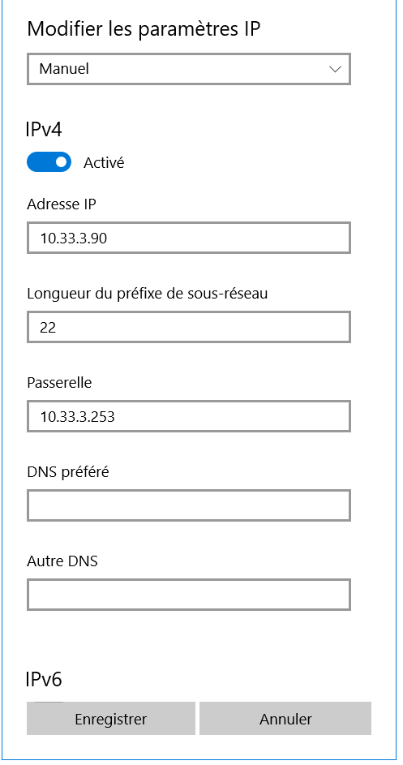

# Heberger image avant de rendre 

# TP1 B2 RESEAUX

## I. Exploration locale en solo

### 1. Affichage d'informations sur la pile TCP/IP locale

***En ligne de commande***

Wifi
```
$networksetup -listallhardwareports

Hardware Port: Wi-Fi
Device: en0
Ethernet Address: a0:78:17:67:3a:d4
```

Ethernet

```
$networksetup -listallhardwareports

Hardware Port: Ethernet Adaptor (en3)
Device: en3
Ethernet Address: 1e:00:62:02:c3:05
```

```
$route get default |grep gateway

gateway: 10.33.3.253
```

***En graphique (GUI : Graphical User Interface)***


***La passerelle (gateway) sert à relier le réseau d'Ynov à d'autres machines.***

### 2. Modifications des informations

#### A. Modification d'adresse IP (part 1)




***En faisant cette opération, on peut perdre l'accès car l'ip peut être déjà utilisée par une autre machine.***

#### B. Table ARP

```
$arp -a
? (10.33.0.3) at 22:93:d2:7e:9f:1a on en0 ifscope [ethernet]
? (10.33.0.8) at ee:6b:a1:17:e3:b6 on en0 ifscope [ethernet]
? (10.33.0.10) at b0:6f:e0:4c:cf:ea on en0 ifscope [ethernet]
? (10.33.0.20) at 74:29:af:33:1b:69 on en0 ifscope [ethernet]
? (10.33.0.21) at b0:fc:36:ce:9c:89 on en0 ifscope [ethernet]
? (10.33.0.27) at a8:64:f1:8b:1d:4d on en0 ifscope [ethernet]
? (10.33.0.36) at 96:96:2:ce:54:2f on en0 ifscope [ethernet]
? (10.33.0.41) at b0:eb:57:82:54:35 on en0 ifscope [ethernet]
? (10.33.0.44) at 30:35:ad:db:53:fe on en0 ifscope [ethernet]
? (10.33.0.45) at f2:4a:90:92:79:12 on en0 ifscope [ethernet]
? (10.33.0.54) at d0:3c:1f:fd:6f:88 on en0 ifscope [ethernet]
? (10.33.0.58) at 80:30:49:b9:f4:3d on en0 ifscope [ethernet]
```

```
? (10.33.3.253) at 0:12:0:40:4c:bf on en0 ifscope [ethernet]
```

```
$ping 10.33.3.109
PING 10.33.3.109 (10.33.3.109): 56 data bytes
64 bytes from 10.33.3.109: icmp_seq=0 ttl=64 time=57.184 ms
64 bytes from 10.33.3.109: icmp_seq=1 ttl=64 time=76.376 ms
64 bytes from 10.33.3.109: icmp_seq=2 ttl=64 time=13.025 ms
64 bytes from 10.33.3.109: icmp_seq=3 ttl=64 time=114.261 ms
64 bytes from 10.33.3.109: icmp_seq=4 ttl=64 time=30.521 ms
```

```
? (10.33.3.109) at 38:f9:d3:2f:c2:79 on en0 ifscope [ethernet]
```

#### C. nmap

```
$nmap -sP 10.33.0.0/22
Starting Nmap 7.92 ( https://nmap.org ) at 2021-09-13 16:52 CEST
Nmap scan report for 10.33.0.8
Host is up (0.060s latency).
Nmap scan report for 10.33.0.10
Host is up (0.042s latency).
Nmap scan report for 10.33.0.20
Host is up (0.0074s latency).
Nmap scan report for 10.33.0.44
Host is up (0.078s latency).
Nmap scan report for 10.33.0.66
Host is up (0.099s latency).
Nmap scan report for 10.33.0.85
Host is up (0.028s latency).
Nmap scan report for 10.33.0.114
Host is up (0.019s latency).
```
## II. Exploration locale en duo

#### Création du réseau (oupa)

Modification d'adresse IP


Ping de la deuxième machine

```
$ping 192.168.1.1

Envoi d’une requête 'Ping'  192.168.1.1 avec 32 octets de données :
Réponse de 192.168.1.1 : octets=32 temps=2 ms TTL=128
Réponse de 192.168.1.1 : octets=32 temps=2 ms TTL=128
Réponse de 192.168.1.1 : octets=32 temps=1 ms TTL=128
Réponse de 192.168.1.1 : octets=32 temps=2 ms TTL=128

Statistiques Ping pour 192.168.1.1:
    Paquets : envoyés = 4, reçus = 4, perdus = 0 (perte 0%),
Durée approximative des boucles en millisecondes :
    Minimum = 1ms, Maximum = 2ms, Moyenne = 1ms
```

Table ARP

```
$arp -a

Interface : 10.10.1.1 --- 0x3
  Adresse Internet      Adresse physique      Type
  10.10.1.255           ff-ff-ff-ff-ff-ff     statique
  224.0.0.22            01-00-5e-00-00-16     statique
  224.0.0.251           01-00-5e-00-00-fb     statique
  224.0.0.252           01-00-5e-00-00-fc     statique
  239.255.255.250       01-00-5e-7f-ff-fa     statique

Interface : 192.168.56.1 --- 0x11
  Adresse Internet      Adresse physique      Type
  192.168.56.255        ff-ff-ff-ff-ff-ff     statique
  224.0.0.22            01-00-5e-00-00-16     statique
  224.0.0.251           01-00-5e-00-00-fb     statique
  224.0.0.252           01-00-5e-00-00-fc     statique
  239.255.255.250       01-00-5e-7f-ff-fa     statique

Interface : 192.168.1.2 --- 0x3a
  Adresse Internet      Adresse physique      Type
  192.168.1.1           b4-b6-86-ed-e1-5c     dynamique
  192.168.1.3           ff-ff-ff-ff-ff-ff     statique
  224.0.0.22            01-00-5e-00-00-16     statique
  224.0.0.251           01-00-5e-00-00-fb     statique
  224.0.0.252           01-00-5e-00-00-fc     statique
  239.255.255.250       01-00-5e-7f-ff-fa     statique
  255.255.255.255       ff-ff-ff-ff-ff-ff     statique
```

#### Utilisation d'un des deux comme gateway


```
PS C:\Users\donat> ping 8.8.8.8

Envoi d’une requête 'Ping'  8.8.8.8 avec 32 octets de données :
Réponse de 8.8.8.8 : octets=32 temps=17 ms TTL=115
Réponse de 8.8.8.8 : octets=32 temps=17 ms TTL=115
Réponse de 8.8.8.8 : octets=32 temps=18 ms TTL=115
Délai d’attente de la demande dépassé.

Statistiques Ping pour 8.8.8.8:
    Paquets : envoyés = 4, reçus = 3, perdus = 1 (perte 25%),
Durée approximative des boucles en millisecondes :
    Minimum = 17ms, Maximum = 18ms, Moyenne = 17ms
```

```
PS C:\Users\donat> tracert -4 8.8.8.8

Détermination de l’itinéraire vers 8.8.8.8 avec un maximum de 30 sauts.

  1     1 ms     1 ms     1 ms  LAPTOP-6DKUMHGK [192.168.1.2]
  2     *        *        *     Délai d’attente de la demande dépassé.
  3    24 ms     8 ms     6 ms  10.33.3.253
  4     6 ms     4 ms     4 ms  10.33.10.254
  5     9 ms     7 ms     5 ms  92.103.174.137
  6     9 ms    11 ms    10 ms  92.103.120.182
  7    22 ms    20 ms    23 ms  172.19.130.117
  8    23 ms    21 ms    22 ms  46.218.128.74
  9    23 ms    20 ms    22 ms  194.6.147.38
 10    21 ms    27 ms    20 ms  72.14.194.30
 11    31 ms    83 ms    20 ms  172.253.69.49
 12    24 ms    21 ms    21 ms  142.250.224.93
 13   182 ms    56 ms    53 ms  8.8.8.8

Itinéraire déterminé.
```

#### Petit Chat Privé

Client

```
$nc.exe 192.168.1.1 8888
yo gang
salut
yoo
ezee
sdvvdsv
efkejkhf
fefe
```

Serveur 

```
C:\netcat-1.11> .\nc.exe -l -p 8888
yo gang
salut
yoo
ezee
sdvvdsv
efkejkhf
fefe
```

#### Firewall

Autoriser les ping

(Ouvrir le terminal en administrateur)

```
$netsh firewall set icmpsetting 8 enable

IMPORTANT : La commande a bien été exécutée.
Cependant, "netsh firewall" n'est plus utilisé ;
utilisez "netsh advfirewall firewall" à la place.
Pour plus d'informations sur l'utilisation des commandes "netsh advfirewall firewall"
à la place de "netsh firewall", consultez l'article 947709 de la base de connaissances
à l'adresse https://go.microsoft.com/fwlink/?linkid=121488.

Ok.
```
```
$ping 192.168.1.1

Envoi d’une requête 'Ping'  192.168.1.1 avec 32 octets de données :
Réponse de 192.168.1.1 : octets=32 temps=1 ms TTL=128
Réponse de 192.168.1.1 : octets=32 temps=2 ms TTL=128
Réponse de 192.168.1.1 : octets=32 temps=2 ms TTL=128
Réponse de 192.168.1.1 : octets=32 temps=2 ms TTL=128

Statistiques Ping pour 192.168.1.1:
    Paquets : envoyés = 4, reçus = 4, perdus = 0 (perte 0%),
Durée approximative des boucles en millisecondes :
    Minimum = 1ms, Maximum = 2ms, Moyenne = 1ms
```

***On ouvre le port 8888 entrant et sortant, et on relance le chat privé avec cette fois le pare feu activé.***

## III. Manipulations d'autres outils/protocoles côté client

### 2. DNS


```
$nslookup google.com

Serveur :   UnKnown
Address:  10.33.10.2

Réponse ne faisant pas autorité :
Nom :    google.com
Addresses:  2a00:1450:4007:817::200e
          216.58.214.78
```
```
$nslookup ynov.com

Serveur :   UnKnown
Address:  10.33.10.2

Réponse ne faisant pas autorité :
Nom :    ynov.com
Address:  92.243.16.143
```

L'adresse du serveur est le DNS d'ynov : 10.33.10.2

```
$nslookup 78.74.21.21

Serveur :   UnKnown
Address:  10.33.10.2

Nom :    host-78-74-21-21.homerun.telia.com
Address:  78.74.21.21

```
```
$nslookup 92.146.54.88

Serveur :   UnKnown
Address:  10.33.10.2

Nom :    apoitiers-654-1-167-88.w92-146.abo.wanadoo.fr
Address:  92.146.54.88
```

## IV. Wireshark!

### Ping


### Netcat


